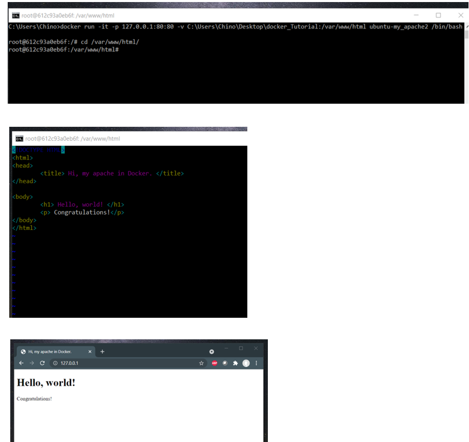

Working Project:

https://chinonsochima.github.io/frontend-2021/

This is based on this tutorial:

Install these packages in order - use the npm install terminal command for each module:
https://webpack.js.org/loaders/style-loader/
https://webpack.js.org/loaders/css-loader/
https://webpack.js.org/loaders/sass-loader/

Then update your webpack.config.js rules to add what i have 

Guide to SASS:
https://sass-lang.com/guide

Prerequisites:
Install Node:
https://nodejs.org/en/download/

Install Webpack Globally by running this command on your terminal / command prompt

npm install --global webpack

Webpack Documentation: https://webpack.js.org/

To Use:

1. Clone the Repo
2. Run npm install
3. Run webpack serve to live reload your project, so you can see changes without refreshing the browser
4. Once it's running you can go to the dev server and see your changes: http://localhost:8080/
5. **run "webpack build" to bundle your code and put it in the docs folder so github pages can serve it**

Press Control C to stop the server or the builder

Turn on github pages and put a link to your site in the readme when you turn in the github repo link.

Based on this tutorial:

https://medium.com/@rahulguptalive/create-crud-apis-in-nodejs-express-and-mysql-abda4dfc2d6